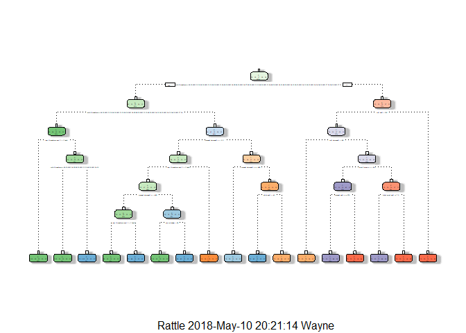

# Introduction

Using devices such as Jawbone Up, Nike FuelBand, and Fitbit it is now easy to collect a large amount of data about personal exercise activity.  Data for this project was collected from 6 participants using accelerometers on the belt, forearm, arm, and dumbell. Participants were asked to perform barbell lifts correctly and incorrectly in 5 different ways. 

More information is available from the website here: http://web.archive.org/web/20161224072740/http:/groupware.les.inf.puc-rio.br/har. 

# Project Goal

The goal of this project is to come up with a model that accurately predicts the manner in which participants did the exercise.

# Download and Read Data

```r
options(warn=-1)
library(knitr)
library(caret)
library(rpart)
library(rpart.plot)
library(randomForest)
library(rattle)
options(warn=0)
```

```r
trainUrl <-"https://d396qusza40orc.cloudfront.net/predmachlearn/pml-training.csv"
testUrl <- "https://d396qusza40orc.cloudfront.net/predmachlearn/pml-testing.csv"
trainFile <- "./data/pml-training.csv"
testFile  <- "./data/pml-testing.csv"
if (!file.exists("./data")) {
  dir.create("./data")
}
if (!file.exists(trainFile)) {
  download.file(trainUrl, destfile=trainFile)
}
if (!file.exists(testFile)) {
  download.file(testUrl, destfile=testFile)
}
setwd("./data")

training <- read.csv(("pml-training.csv"), na.strings=c("NA",""))

testing <- read.csv(("pml-testing.csv"), na.strings=c("NA",""))

dim(training)
```

```
## [1] 19622   160
```

The original data set has 19622 rows and 160 variables

# Clean The Data

Cleaning the data set includes removing columns with more than 50% missing values, removing columns with little variablility, and setting the level of factor variables in the testing data set equal to the levels in the training data set.

```r
# Remove first column which is just an index

training <- training[c(-1)]

# Remove columns with more than 50% missing values

training<-training[, -which(colMeans(is.na(training)) > 0.5)]
dim(training)
```

```
## [1] 19622    59
```

After removing the index column and columns with more than 50% missing values the data set has  59 variables.


```r
# Remove variables with little variability

nzv <- nearZeroVar(training, saveMetrics=TRUE)
training <- training[,nzv$nzv==FALSE]
dim(training)
```

```
## [1] 19622    58
```

After removing columns with little variablility the data set used for analysis has 19622 rows and 58 variables


```r
# Need to make sure levels in factor variables are the same 
# in training and testing data sets
common <- intersect(names(training), names(testing)) 
for (p in common) { 
  if (class(training[[p]]) == "factor") { 
    levels(testing[[p]]) <- levels(training[[p]]) 
  } 
}
```

# Split the Training Data Set

The cleaned data set will next be split into a training data set (mytrain) containing 60% of the data and a validation data set (mytest). The mytest data set will be used for cross validation of the prediction models.


```r
set.seed(13579)  #set seed for reprodicibility
inTrain <- createDataPartition(training$classe, p=0.60, list=FALSE)
mytrain <- training[inTrain, ]
mytest <- training[-inTrain, ]
dim(mytrain)
```

```
## [1] 11776    58
```

```r
dim(mytest)
```

```
## [1] 7846   58
```

# Prediction Models

### Tree Prediction

I will first try a simple tree prediction model using rpart on the training data, display the prediction tree with fancyRpartPlot, crossvalidate the model on the validation data, and then estimate the accuracy using confusionMatrix.


```r
modFit1 <- rpart(classe ~ ., data=mytrain, method="class")
fancyRpartPlot(modFit1)
```

<!-- -->

```r
predictions1 <- predict(modFit1, mytest, type = "class")
contree <- confusionMatrix(predictions1, mytest$classe)
contree
```

```
## Confusion Matrix and Statistics
## 
##           Reference
## Prediction    A    B    C    D    E
##          A 2154   59    5    5    0
##          B   52 1256   90   66    0
##          C   26  191 1243  201   57
##          D    0   12   17  900   90
##          E    0    0   13  114 1295
## 
## Overall Statistics
##                                           
##                Accuracy : 0.8728          
##                  95% CI : (0.8652, 0.8801)
##     No Information Rate : 0.2845          
##     P-Value [Acc > NIR] : < 2.2e-16       
##                                           
##                   Kappa : 0.8391          
##  Mcnemar's Test P-Value : NA              
## 
## Statistics by Class:
## 
##                      Class: A Class: B Class: C Class: D Class: E
## Sensitivity            0.9651   0.8274   0.9086   0.6998   0.8981
## Specificity            0.9877   0.9671   0.9267   0.9819   0.9802
## Pos Pred Value         0.9690   0.8579   0.7235   0.8832   0.9107
## Neg Pred Value         0.9861   0.9589   0.9796   0.9435   0.9771
## Prevalence             0.2845   0.1935   0.1744   0.1639   0.1838
## Detection Rate         0.2745   0.1601   0.1584   0.1147   0.1651
## Detection Prevalence   0.2833   0.1866   0.2190   0.1299   0.1812
## Balanced Accuracy      0.9764   0.8973   0.9177   0.8409   0.9391
```

The estimated accuracy of the prediction for this model is 87.28%. The estimated out-of-sample error is 12.72%.  

The accuracy of this model is too low, so next I will try a random forest model.

### Random Forest Prediction

A random forest algorithm will automatically select the most important variables.

This model will use randomForest on the training data,  crossvalidate the model on the validation data, and then estimate the accuracy using confusionMatrix.


```r
modFit2 <- randomForest(classe ~ ., data=mytrain)
prediction2 <- predict(modFit2, mytest, type = "class")
conrf <- confusionMatrix(prediction2, mytest$classe)
conrf
```

```
## Confusion Matrix and Statistics
## 
##           Reference
## Prediction    A    B    C    D    E
##          A 2231    1    0    0    0
##          B    1 1517    2    0    0
##          C    0    0 1366    2    0
##          D    0    0    0 1284    2
##          E    0    0    0    0 1440
## 
## Overall Statistics
##                                          
##                Accuracy : 0.999          
##                  95% CI : (0.998, 0.9996)
##     No Information Rate : 0.2845         
##     P-Value [Acc > NIR] : < 2.2e-16      
##                                          
##                   Kappa : 0.9987         
##  Mcnemar's Test P-Value : NA             
## 
## Statistics by Class:
## 
##                      Class: A Class: B Class: C Class: D Class: E
## Sensitivity            0.9996   0.9993   0.9985   0.9984   0.9986
## Specificity            0.9998   0.9995   0.9997   0.9997   1.0000
## Pos Pred Value         0.9996   0.9980   0.9985   0.9984   1.0000
## Neg Pred Value         0.9998   0.9998   0.9997   0.9997   0.9997
## Prevalence             0.2845   0.1935   0.1744   0.1639   0.1838
## Detection Rate         0.2843   0.1933   0.1741   0.1637   0.1835
## Detection Prevalence   0.2845   0.1937   0.1744   0.1639   0.1835
## Balanced Accuracy      0.9997   0.9994   0.9991   0.9991   0.9993
```

The estimated accuracy of the prediction for this model is 0.999%. The estimated out-of-sample error is 0.102%.

As the random forest prediction accuracy is very high, no further models need to be examined.

# Prediction for the Test Data Set

Finally the random forest model will be applied to the 20 test data observations.


```r
# Apply the model to the test data set

predict(modFit2, testing, type = "class")
```

```
##  1  2  3  4  5  6  7  8  9 10 11 12 13 14 15 16 17 18 19 20 
##  B  A  B  A  A  E  D  B  A  A  B  C  B  A  E  E  A  B  B  B 
## Levels: A B C D E
```
